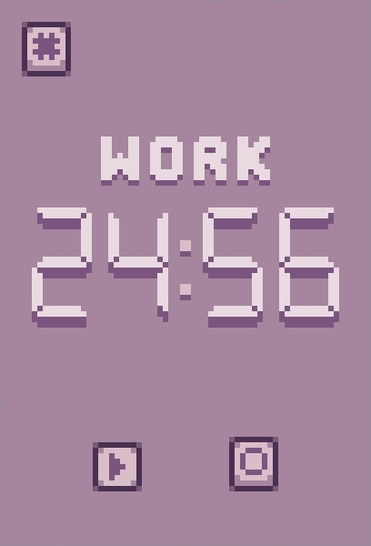

<div align="Center" display="inline-block">

</div>


# DiSPuTe


**The Damn Stylish Pomodoro Timer**

Designed to get better productivity while staying healthy and motivated

# Features
🎯 Simple and strict: there is no pause button or ability to skip a round.
Dispute contains only what you really need to actually get work done

✨ Clean, yet beautiful and unique UI design with animations and sound effects

💻 Dispute can hide its window and quietly sit in your tray. Just launch it
again to re-open the window

🦀 <s>Written in Ru</s> Is this even a feature in the modern day?


# Installation

### Linux (AppImage)
 - Download latest AppImage from the [releases](https://github.com/Vinegret43/dispute/releases) page
 - Open your terminal and CD into the directory where it's downloaded
 - Run `chmod +x dispute-linux.AppImage` and `./dispute-linux.AppImage --install`
 - Now Dispute is available in your app launcher. Enjoy!

### Windows
 - Download latest exe file from the [releases](https://github.com/Vinegret43/dispute/releases) page
 - Also download the editundo.ttf font from the same page and install it
 - Now you should be able to open Dispute with a simple double-click!

### From source
Note that, when built on UNIX, Dispute requires QT to be installed on your
system

To compile and install Dispute from source, run these commands in the
following order:
```sh
git clone "https://github.com/Vinegret43/dispute"
cd dispute
# May take a while, so be patient
cargo build --release
# You don't have to copy it to ~/.local/bin, any directory which is in
# your $PATH should be fine
cp target/release/dispute ~/.local/bin
# Installs desktop files so you can launch Dispute from your app launcher.
# UNIX-only
dispute --install
```
